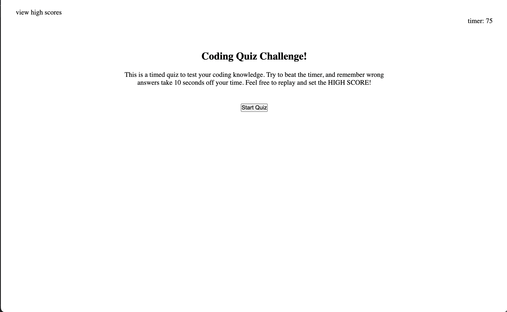

# coding-quiz

Pressing the start quiz button will begin a timed quiz about coding.

Wrong answers will subract 10 seconds from the available time.  If the timer hits zero, the quiz ends.  Once the quiz is completed the remaining time will be the user's score that they can submit to the high-score board with their initials.

The high-scores may be viewed at any time by clicking "view high scores" at the top left of the screen.  From the high scores table you may either go back to the quiz by clicking the  "go back" button, or you may reset the highscores by clicking "clear high scores".

https://frodrickfronkenstein.github.io/coding-quiz/

https://github.com/frodrickfronkenstein/coding-quiz